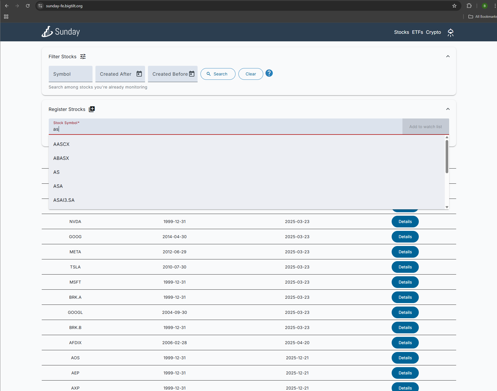
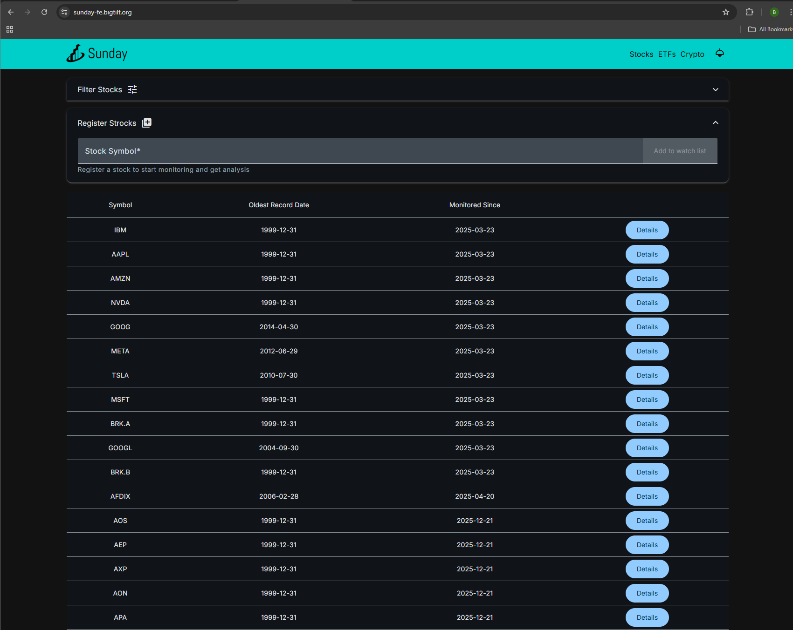
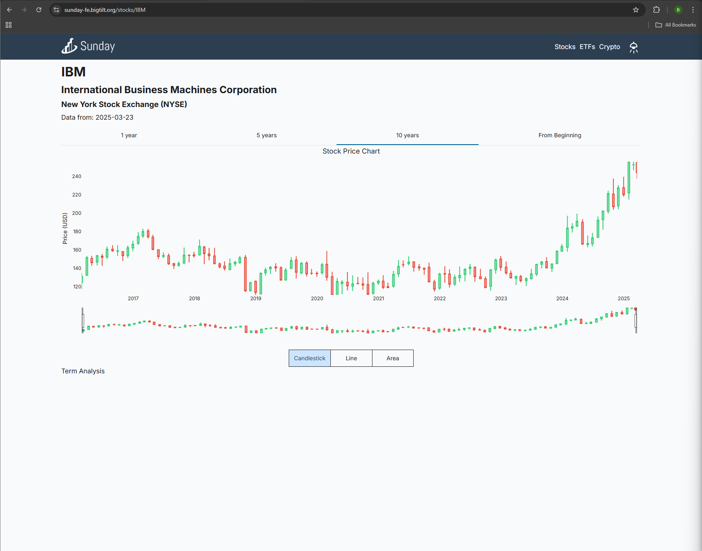
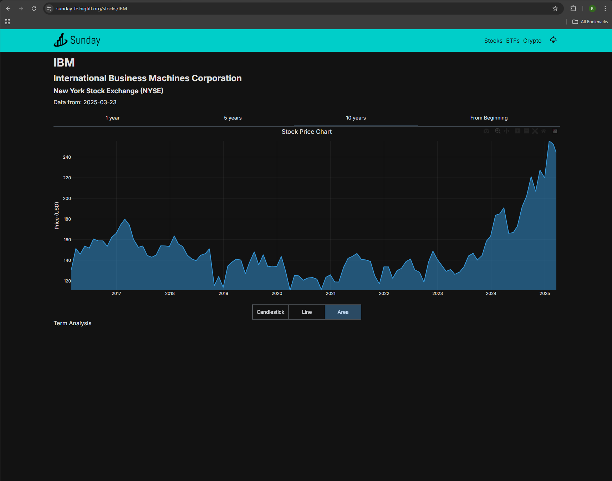
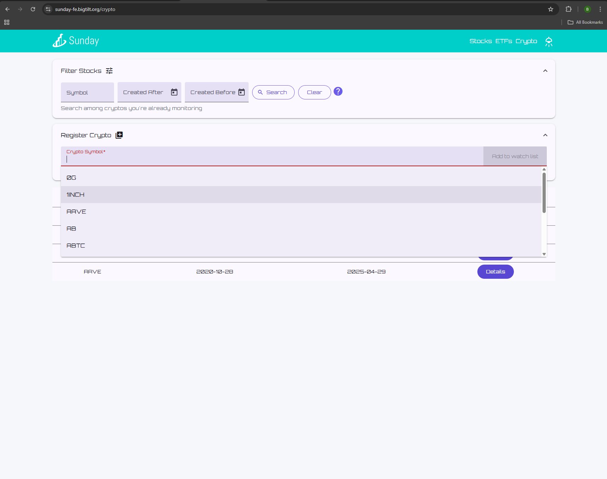
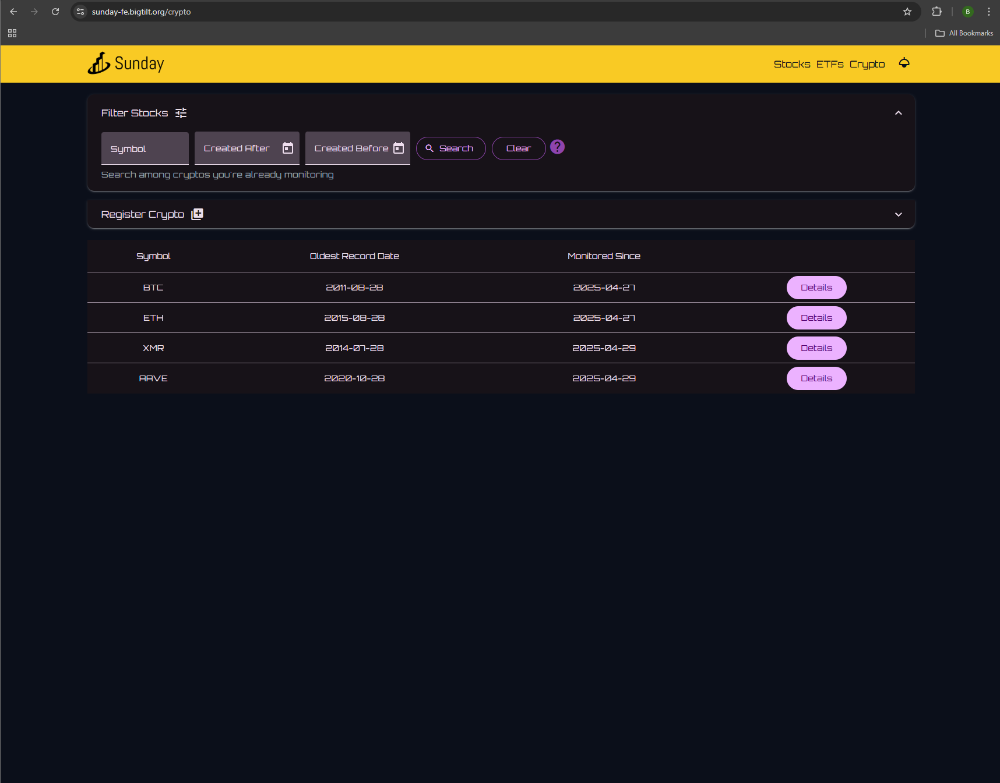
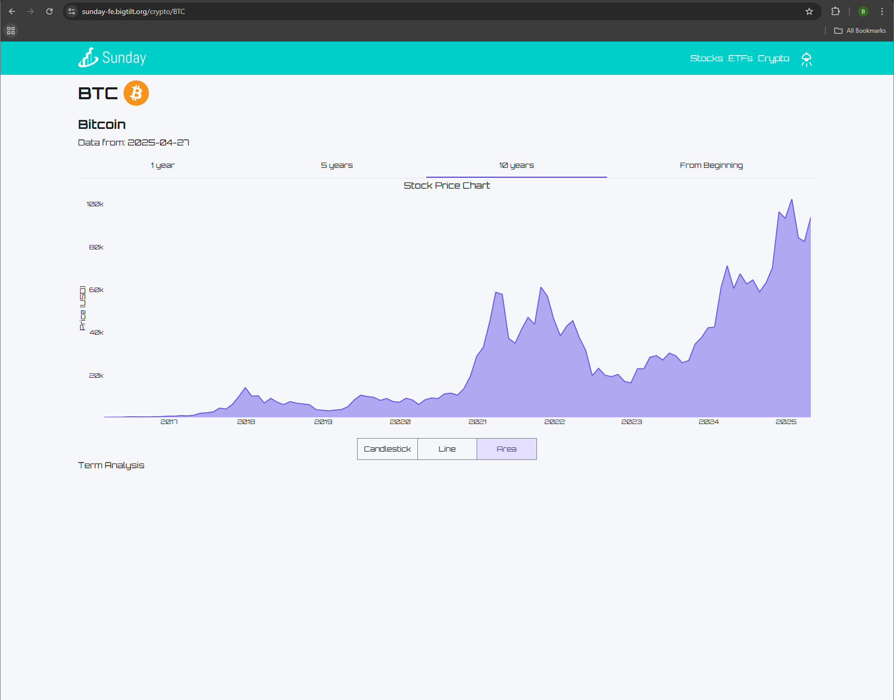
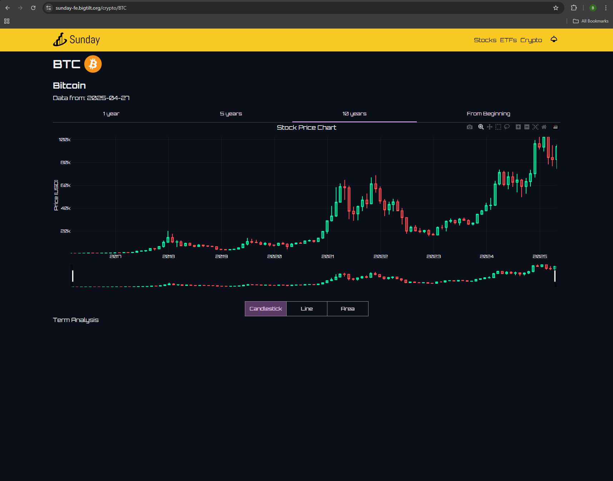
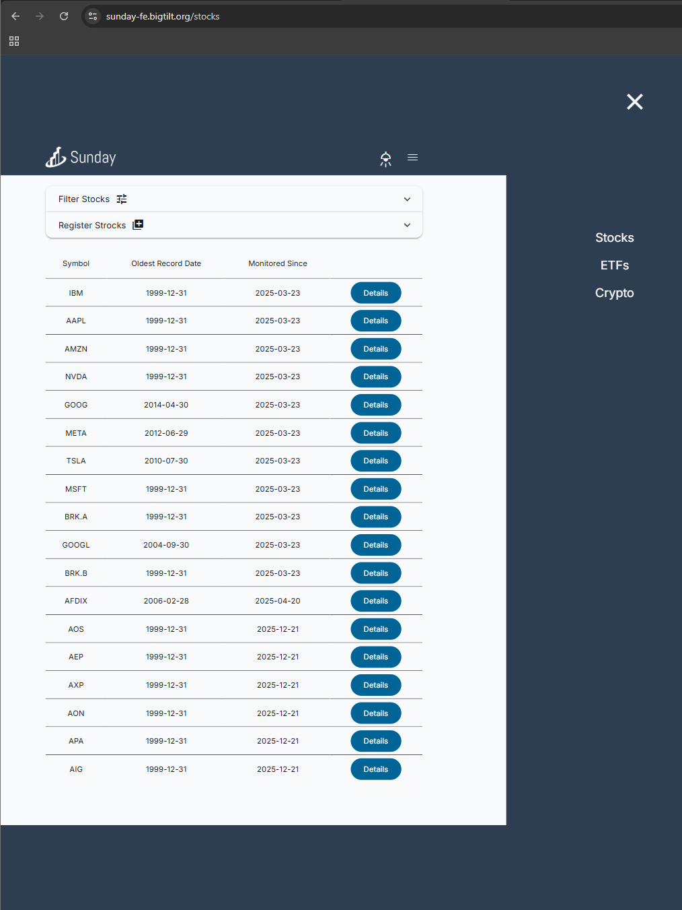
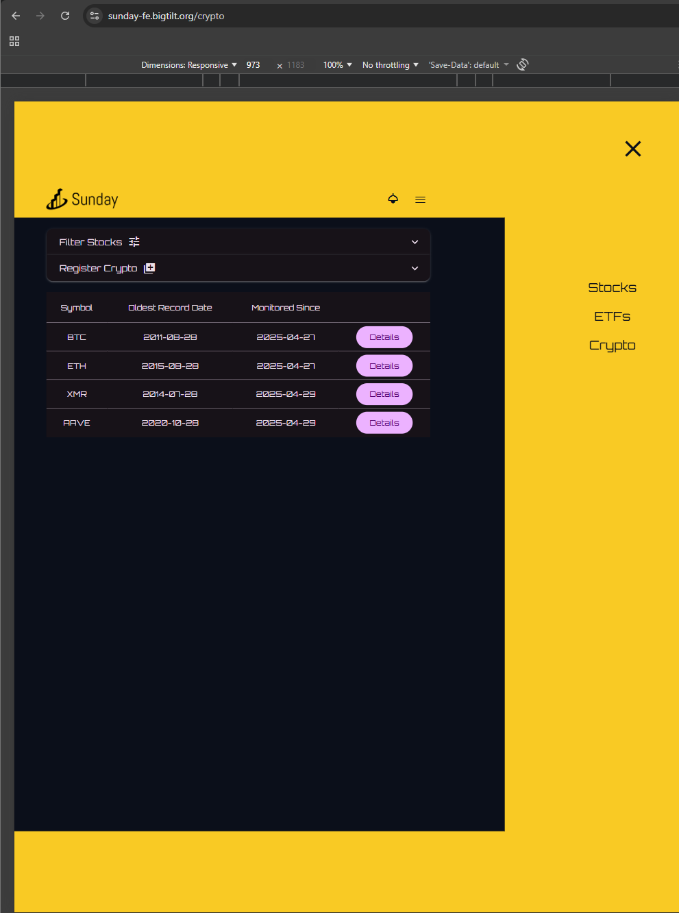

# Sunday

A full-stack financial tracking application for monitoring **stocks** and **cryptocurrencies** in one place. Built with Angular 19 and NestJS, Sunday provides real-time market data, filtering, and detailed asset analysis through a clean Material Design interface.

---

## Screenshots

### Stocks — List

| Light | Dark |
|---|---|
|  |  |

### Stocks — Details

| Light | Dark |
|---|---|
|  |  |

### Crypto — List

| Light | Dark |
|---|---|
|  |  |

### Crypto — Details

| Light | Dark |
|---|---|
|  |  |

### Mobile

| Light | Dark |
|---|---|
|  |  |

---

## Features

### Stocks
- Browse and search S&P 500 stock symbols
- Filter by symbol name and date range
- View detailed stock information (price, exchange, symbol)
- Register new stocks for tracking
- Automated daily data updates via scheduled tasks

### Crypto
- Browse and search cryptocurrency symbols
- Filter by symbol name and date range
- View detailed crypto data (price, supply, market cap, precision)
- Register new cryptocurrencies for tracking

### General
- Data visualization with interactive Plotly.js charts
- Caching layer for improved performance
- Server-side rendering (SSR) support
- Responsive UI with Angular Material

---

## Tech Stack

| Layer | Technology |
|---|---|
| Frontend | Angular 19, Angular Material, RxJS, Plotly.js |
| Backend | NestJS 10, TypeORM |
| Database | PostgreSQL 15 |
| Validation | Zod (shared monorepo library) |
| Infrastructure | Docker, Docker Compose |

---

## Project Structure

```
sunday/
├── backend/          # NestJS API
│   └── src/
│       ├── modules/
│       │   ├── stocks/
│       │   ├── crypto/
│       │   ├── stock-symbols/
│       │   ├── crypto-symbols/
│       │   └── cache/
│       └── migrations/
├── frontend/         # Angular 19 SPA
│   └── src/app/
│       └── features/
│           ├── stocks/
│           └── crypto/
├── libs/
│   └── validations/  # Shared Zod schemas
├── docker-compose.yaml
└── docker-compose.local.yaml
```

---

## Getting Started

### Prerequisites

- [Node.js](https://nodejs.org/) v22+
- [Docker](https://www.docker.com/) & Docker Compose
- npm

### 1. Clone the repository

```bash
git clone <repo-url>
cd sunday
```

### 2. Configure environment variables

Create `backend/.env.local`:

```env
PORT=4322
NODE_ENV=local

PG_HOST=localhost
PG_PORT=5434
PG_USERNAME=dev
PG_PASSWORD=123
PG_NAME=postgre

ALPHA_VANTAGE_API_KEY=your_key_here
FINANCIAL_MODELING_PREP_API_KEY=your_key_here
COIN_DESK_API_KEY=your_key_here
```

> API keys can be obtained from [Alpha Vantage](https://www.alphavantage.co/), [Financial Modeling Prep](https://financialmodelingprep.com/), and [CoinDesk](https://www.coindesk.com/coindesk-api).

### 3. Start the database

```bash
npm run start:db
```

### 4. Run the backend

```bash
npm run start:nest
```

### 5. Run the frontend

```bash
npm run start:fe
```

---

## Available Scripts

Run these from the project root:

| Script | Description |
|---|---|
| `npm run start:db` | Start PostgreSQL in Docker |
| `npm run start:nest` | Start NestJS backend (dev mode) |
| `npm run start:be-local` | Start backend + DB together |
| `npm run start:fe` | Start Angular frontend |
| `npm run start:fe-ssr-dev` | Start frontend with SSR in dev mode |
| `npm run lint` | Run ESLint |
| `npm run format` | Run Prettier |
| `npm run update:validations` | Rebuild shared validation library |

### Database Migrations

```bash
cd backend

# Generate a new migration
npm run migration:generate -- src/migrations/MigrationName

# Apply pending migrations
npm run migration:run

# Revert the last migration
npm run migration:revert
```

---

## Docker (Production)

To run the full stack in production mode:

```bash
npm run deploy:prod
```

This starts:
- PostgreSQL 15 on port `5434`
- NestJS backend on port `4321`
- Runs database migrations automatically on startup

---

## External APIs

| API | Used For |
|---|---|
| [Alpha Vantage](https://www.alphavantage.co/) | Stock market data |
| [Financial Modeling Prep](https://financialmodelingprep.com/) | Stock symbol data |
| [CoinDesk](https://www.coindesk.com/coindesk-api) | Cryptocurrency data |

---

## License

MIT
